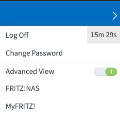
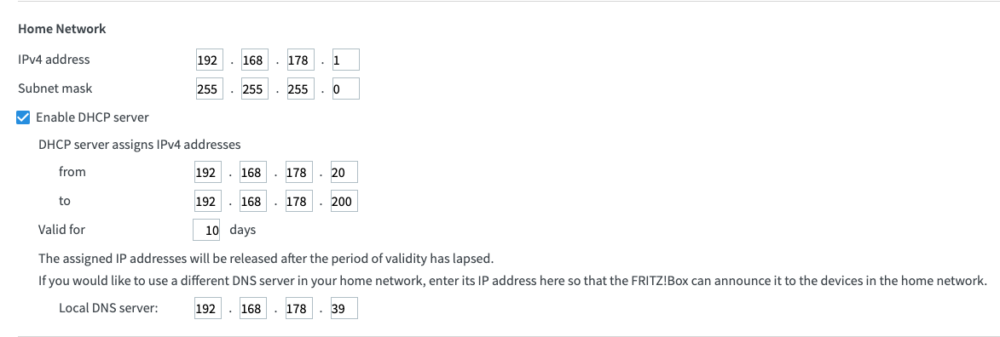
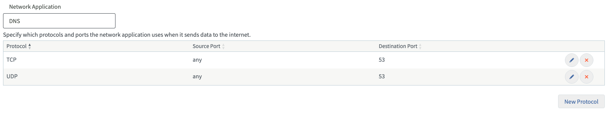
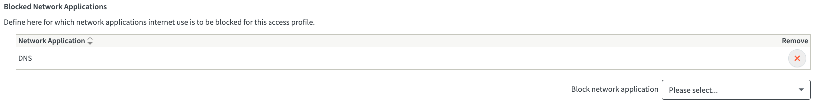
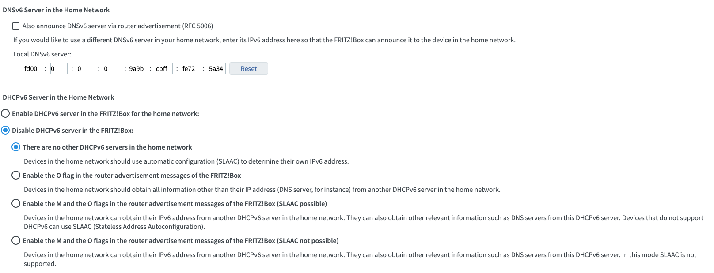

# PiHole & DNS over HTTPS (DoH)

This little project provides a way to set up (and possibly tear down) PiHole in conjunction with cloudflared for DoH on a raspberry pi (RPi).

## What it does

PiHole blocks requests to blacklisted domains (mostly advertising serving) and it uses exclusively cloudflared to enforce DoH. DNS Security Extensions (DNSSEC) is enabled.

## RPi prerequisites

Your RPi should have a static IP and port 80 should be open in order to be able to access PiHoles admin interface.

## Running the project

```bash
cp .env.example .env
# add  settings to .env
docker-compose up -d
```

## Update PiHole

```bash
# pull newest images
docker-compose pull
# restart with newest images
docker-compose up --force-recreate --build -d
# remove unused images
docker image prune -f
```

## Settings in router

I have a FritzBox and therefore the following instructions are only applicable for that router.

Make sure `Advanced View` is enabled. This can be enabled by clicking the three dots in the top right corner:



### Use RPi as DNS server

`Home Network -> Network -> Network Settings -> IPv4 Configuration`

Enter the IP of your RPi as a `Local DNS server`:


### Block DNS

In order to make sure only DoH via cloudflared is used, I block outgoing requests to DNS (port 53).

#### Create a filter for DNS

`Internet -> Filters -> Lists -> Network Applications -> Add Network Application -> New Protocol`

Create a filter for outgoing ports 53 UDP and TCP:


#### Apply the filter

`Internet -> Filters -> Access Profiles -> Edit Standard`

Add the list unter `Blocked Network Applications`


### Disable DNSv6 and DHCPv6

Since PiHole is only set up to handle IPv4, we disable DNS via IPv6.

`Home Network -> Network -> Network Settings -> IPv6 Configuration`



## Check result

In order to check the result of you actions, check [https://1.1.1.1/help](https://1.1.1.1/help).

_Sometimes the DNSSEC setting make this check inaccurate. If DoH is detected as false, try again with disabled DNSSEC (enable it again afterwards!)._

## TODO

- [ ] Enable IPv6

## Resources

https://docs.pi-hole.net/guides/dns/cloudflared/

https://mroach.com/2020/08/pi-hole-and-cloudflared-with-docker/
https://github.com/bipulkkuri/pihole
https://heikorichter.name/post/129/fritzbox-mit-pi-hole-und-dns-over-htttps/
https://www.denniswilmsmann.de/2021/01/pi-hole-und-dns-over-https-doh/
